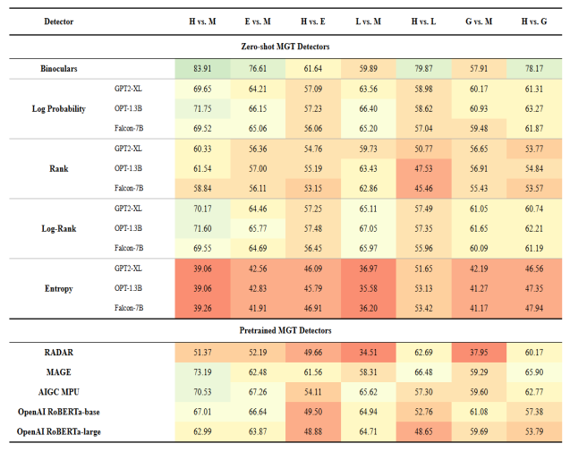
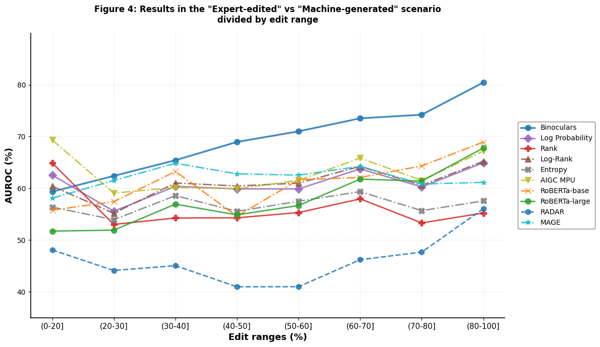

# Can AI-Text Detectors Catch Human-Edited AI Writing? A Reproduction of Beemo

**Reproducibility study of *Beemo: Benchmark of Expert-edited Machine-generated Outputs* (Artemova et al., NAACL 2025).** We re-ran 18 machine-generated text (MGT) detectors across 7 detection tasks (126 experiments) to test whether the paper's main claims hold: that text generated by an LLM and then edited by a human expert slips past today's detectors, while LLM-edited text is still caught.

Research study for **CS 421: Natural Language Processing**, University of Illinois Chicago (Fall 2025).
📄 [Read the full report](report/Beemo_Reproducibility_Report.pdf)

---

## Why this matters

Most AI-text detection benchmarks compare purely human text with purely machine text. Real-world text is often mixed: someone generates a draft with an LLM and then edits it, or asks another LLM to "make it sound more human." Beemo is one of the first benchmarks built for this multi-author setting. Reproducing it tests whether its conclusions are reliable enough to build on.

## What we did

* **Dataset:** [Beemo](https://huggingface.co/datasets/toloka/beemo), 19,683 texts across five task types (closed QA, open QA, generation, rewriting, summarization), each with human-written (H), machine-generated (M), expert-edited (E), Llama-3.1-70B-edited (L) and GPT-4o-edited (G) versions.
* **Detectors (18 of the paper's 33 configurations):**
  * **Zero-shot:** Binoculars, plus Log Probability, Log-Rank, Rank and Entropy, each with three backbone LLMs (GPT-2 XL, OPT-1.3B, Falcon-7B).
  * **Pretrained classifiers:** MAGE, RADAR, AIGC-MPU, OpenAI RoBERTa-base and RoBERTa-large.
* **Tasks:** 7 binary classification settings: H vs M, E vs M, H vs E, L vs M, H vs L, G vs M, H vs G.
* **Metric:** AUROC, which is threshold-independent and matches the original paper.
* **Extra analysis:** detector performance as a function of how much of the text the expert edited.

## Key results



**Most of the paper's claims reproduced, usually within a few AUROC points.**

| Claim from the paper | Reproduced? | What we found |
|---|---|---|
| Binoculars is the best zero-shot detector, MAGE the best pretrained one, Entropy near random | ✅ Yes | Binoculars reached 0.839 AUROC on H vs M; Entropy stayed around or below 0.5 |
| Expert editing evades detection (drops of up to ~22%) | ✅ Yes | Binoculars fell from 0.839 to 0.616 (-22.3%, paper: -22%), and other detectors closely matched the paper's drops |
| LLM-edited text stays detectable, expert-edited text does not | ✅ Yes | H vs E scores were close to random (~0.5 to 0.6), while Binoculars still scored 0.799 on H vs L |
| Zero-shot detectors generalize better to edited text | ⚠️ Partly | Zero-shot was strongest on H vs M, but MAGE (pretrained) had the smallest drop under expert editing |
| Bigger backbone models perform better | ❌ Not supported | No consistent gain from GPT-2 XL to OPT-1.3B to Falcon-7B (we could not run Qwen2-7B) |
| Some pretrained detectors fail under distribution shift | ✅ Yes | RADAR scored 0.345 on L vs M and the OpenAI RoBERTa models were near random on H vs E |
| Moderate edits are the most confusing | ⚠️ Mixed | Performance was mostly stable across edit ranges, but in our runs the weakest range was 40 to 60% edited, not the lowest |



### Takeaways

* **Human editing is the real blind spot.** A few expert edits are enough to bring most detectors close to a coin flip, which matters for anyone relying on AI detectors in education or publishing.
* **"Humanizing" with another LLM doesn't work as well.** LLM-rewritten text keeps statistical fingerprints that zero-shot detectors like Binoculars still pick up.
* **Reproductions are worth running.** The headline results held, but the backbone-size claim and the edit-range pattern did not fully replicate.

## Repository structure

```
├── notebooks/
│   ├── zero_shot/        # Binoculars, Log Probability, Log-Rank, Rank, Entropy
│   ├── pretrained/       # MAGE, RADAR, AIGC-MPU, OpenAI RoBERTa base/large
│   └── analysis/         # Edit_percentage.ipynb: AUROC by expert edit range
├── assets/               # Figures used in this README
├── report/               # Full reproducibility report (PDF)
└── requirements.txt
```

## Running it

The notebooks were built for **Google Colab** (T4 GPU; A100 recommended for Binoculars and the Falcon-7B backbones).

1. Open a notebook in Colab and install the dependencies in `requirements.txt`.
2. The dataset loads automatically from Hugging Face (`load_dataset("toloka/beemo")`). The MAGE notebook instead reads a Parquet copy from `MyDrive/Beemo/dataset.parquet`.
3. Each notebook writes its per-task scores and a summary to `MyDrive/BEEMO_Reproducibility/results/` on Google Drive.
4. After running the detectors, run `notebooks/analysis/Edit_percentage.ipynb` to build the edit-range plot from those results.
5. Binoculars needs its own install: `git clone https://github.com/ahans30/Binoculars.git && pip install -e Binoculars`.

**Compute:** about 500 GPU minutes in total on Colab Pro. Binoculars took the longest (about 110 minutes), and each zero-shot backbone took 25 to 50 minutes.

## Limitations

* We ran 18 of the 33 configurations. DetectGPT, DetectLLM and the Qwen2-7B backbone were skipped because of compute limits.
* We only computed aggregated scores, so the paper's per-category claim was not tested.
* Without expert annotators, we used the released edits rather than creating new ones.

## Tech stack

Python · PyTorch · Hugging Face Transformers & Datasets · scikit-learn · pandas · matplotlib · Google Colab

## Team

**Sarah Zahir Syeda** and **Sanjana Venkatesh**

**My contributions:** _[Fill in, e.g. "Ran the zero-shot detectors and the edit-percentage analysis, and wrote the results section."]_

## References

* Artemova et al., *Beemo: Benchmark of Expert-edited Machine-generated Outputs*, NAACL 2025. [Paper](https://aclanthology.org/2025.naacl-long.357/) · [Code](https://github.com/Toloka/beemo)
* Hans et al., *Spotting LLMs with Binoculars: Zero-Shot Detection of Machine-Generated Text*, 2024. [Code](https://github.com/ahans30/Binoculars)
* Su et al., *DetectLLM: Leveraging Log Rank Information for Zero-Shot Detection of Machine-Generated Text*, EMNLP Findings 2023. [Code](https://github.com/mbzuai-nlp/DetectLLM)
